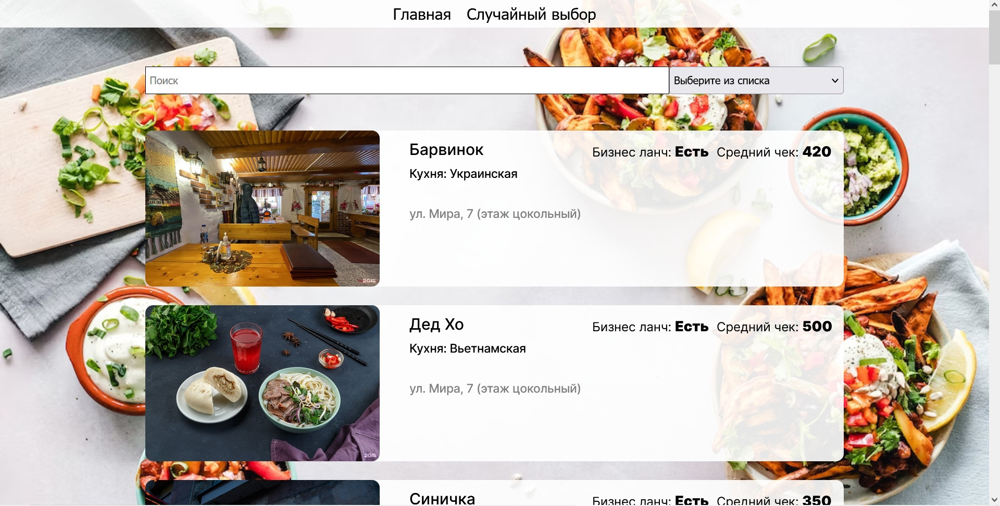

# Проект: Поисковик кафе и ресторанов (Frontend)

- работа, выполненный как тестовое задание по вакансии на frontend-разработчика, а также как проект для изучения синтаксиса и работы с фреймворком Vue. 

## Содержание

 - [Обзор проекта](#обзор-проекта)
    - [Задачи и цели](#задачи-и-цели-проекта)
    - [Функциональность проекта](#функциональность-проекта)
    - [Ссылки](#ссылки)
    - [Директории проекта](#директории-проекта)
    - [Запуск прокета](#запуск-проекта)
 - [Технологии](#технологии)
 - [Автор](#автор)

## Обзор проекта

### Задачи и цели проекта

Задачей работы являлось разработать пример web-приложения на основе базы кофешек.
К целям проекта относятся изучения основного инстументария фреймворка Vue и верстка приложения.

### Функциональность проекта

Проект представляет лендинг сервис поиск кафе и ресторанов по названию, а также сортировка списка по заданным параметрам(наличие бизнес ланча и цене)

На главной странице реализован слайдер с вариантами кафе и их адресом, смена картинки происходит каждые 8 секунд, также пользователь может листать сам.

На странице "Список заведений" релизован поиск и сортировка. 

Пользователь может нажать кнопку "Случайный выбор" в шапке сайта, после нажатия откроется попап со случайно выбранным местом

### Ссылки

[Ссылка на страницу сайта](https://moviedomen.nomoredomains.rocks)

<!-- ### Директории проекта

- `src/components` — компоненты проекта
- `src/contexts` — элементами контекста
- `src/utils` — директория с api, константами и вспомогательными функциями проекта
- `src/images` — изображения
- `src/vendor` — директория с файлами библиотек
- `/fonts` — директория со шрифтами

### Запуск проекта

- `npm run build` — запуск проекта в режиме продакшн
- `npm start` — запуск проекта в режиме разработки

## Технологии

- HTML
- CSS
- JS
- React
- React Router
- Create React App
- Адаптивная вёрстка
- Семантическая вёрстка

## Автор

Илья Бирюлев

- e-mail: birulevila@gmail.com
- tg: [@ilya_bir](https://t.me/ilya_bir)
 -->
